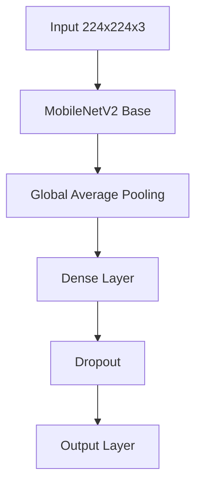
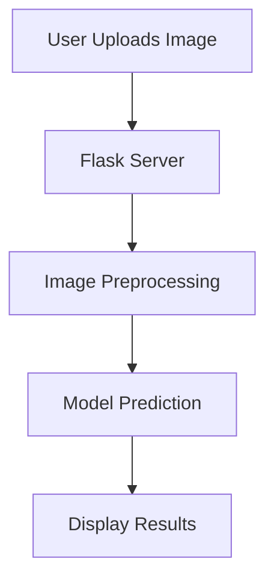

# Skin Disease Classification: Data Science using Deep Learning model

## Overview
This project demonstrates an end-to-end data science workflow to solve a real-world classification problem. By leveraging a Convolutional Neural Network (CNN) with transfer learning, the system achieves 83% accuracy in classifying Acne, Psoriasis, and Vitiligo from skin images. The final output is not just a model, but an interactive web application that provides predictions with model explainability (XAI) to build user trust.

## Key Metrics & Performance
The model's performance was rigorously evaluated on an unseen test dataset to simulate real-world performance.

### Classification Report:
```
              precision    recall  f1-score   support

        Acne       0.84      0.76      0.80        21
   Psoriasis       0.76      0.76      0.76        21
    Vitiligo       0.90      1.00      0.95        18

    accuracy                           0.83        60
```

### Analytical Insights:

- **High Reliability on Vitiligo**: The model is exceptionally good at identifying Vitiligo, with a perfect Recall of 1.00. This means it successfully found every single case of Vitiligo in the test set.

- **Strong Acne Prediction**: With a Precision of 0.84, when the model predicts "Acne," it is correct 84% of the time, making it a reliable indicator.

- **Identified Challenge Area**: The primary source of error is the model sometimes confusing Acne and Psoriasis, which is a known diagnostic challenge and a clear target for future model enhancements.

## Model Architecture
The classification system uses transfer learning with a customized MobileNetV2 architecture:



### Key Technical Specifications:

- **Base Model**: MobileNetV2 (pre-trained on ImageNet)
- **Custom Layers**: Global Average Pooling, Dense (128 units, ReLU), Dropout (0.5), Output (Softmax)
- **Training Configuration**: 20 Epochs, Batch Size of 32, Adam Optimizer, Categorical Crossentropy Loss

## Deployment Architecture
The model is deployed as an interactive web application using Flask.



### Web Application Features:

- Drag image upload  
- Real-time predictions with confidence scores  
- Model attention visualization (Grad-CAM)  
- Responsive design for mobile and desktop  

## Technical Skills Demonstrated

- **End-to-End Project Lifecycle Management**: Successfully managed a project from problem definition and data collection to final deployment and documentation.

- **ETL and Data Preparation**: Developed Python scripts to perform Extract, Transform, and Load (ETL) operations on raw, unstructured image data.

- **Predictive Modeling with Transfer Learning**: Implemented a sophisticated deep learning model (MobileNetV2) using TensorFlow and Keras.

- **Data Augmentation**: Applied data augmentation techniques to prevent overfitting and create a more robust, generalizable model.

- **Advanced Model Evaluation**: Went beyond simple accuracy to rigorously evaluate model performance using a Confusion Matrix, Precision, Recall, and F1-Scores with Scikit-learn.

- **Model Explainability (XAI)**: Integrated Grad-CAM to generate visual heatmaps, providing clear explanations for the model's predictions.

- **Python for Data Science**: Demonstrated proficiency in the core data science stack including NumPy for numerical operations and OpenCV for image processing.

- **Data Visualization**: Created insightful visualizations (Confusion Matrix) using Matplotlib and Seaborn to effectively communicate model performance.

- **API Development & Deployment**: Built and deployed a functional web application using Flask, turning a complex model into an accessible tool.

- **Version Control & Collaboration**: Utilized Git and GitHub for version control, code tracking, and project sharing.

- **Virtual Environment Management**: Used venv and requirements.txt to create a reproducible and isolated project environment.

## Setup and Usage

### 1. Clone the Repository
```bash
git clone https://github.com/yourusername/skin-classifier-project.git
cd skin-classifier-project
```

### 2. Create and Activate Virtual Environment
```bash
# Create the environment
python -m venv .venv

# Activate on Windows
.\.venv\Scripts\activate

# Activate on macOS/Linux
source .venv/bin/activate
```

### 3. Install Dependencies
```bash
pip install -r requirements.txt
```

### 4. Run the Web Application
```bash
python app.py
```

Visit [http://127.0.0.1:5000](http://127.0.0.1:5000) in your browser.

### 5. Run Prediction via Command Line
```bash
python predict_image.py "path/to/your/image.jpg"
```

## Dependencies
```
tensorflow==2.19.0  
keras==3.10.0  
opencv-python==4.12.0.88  
numpy==2.1.3  
scikit-learn  
matplotlib  
seaborn  
flask  
Pillow
```
